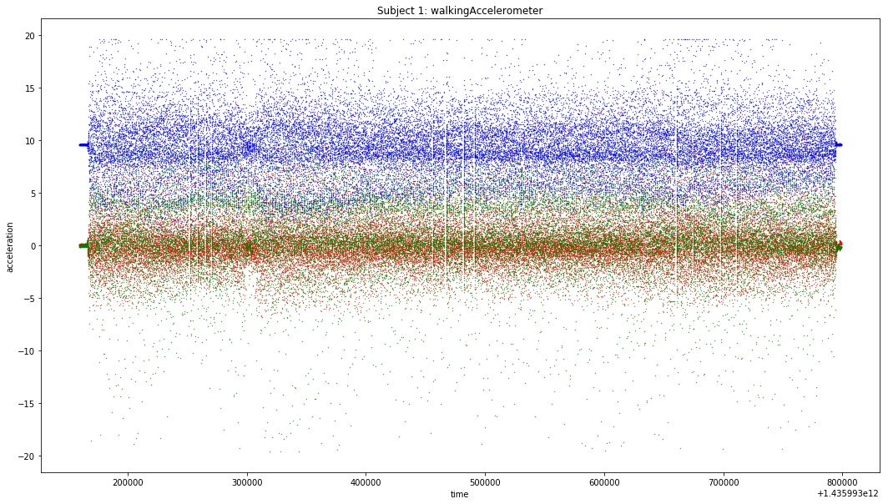
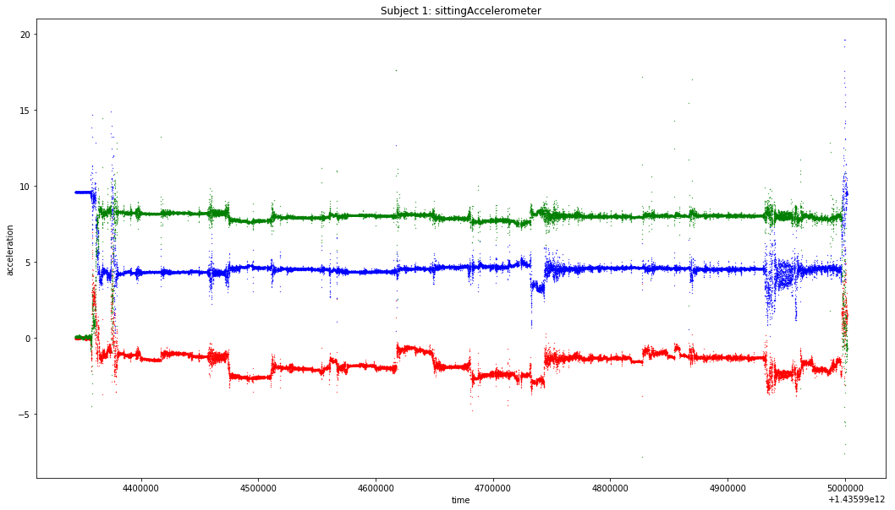
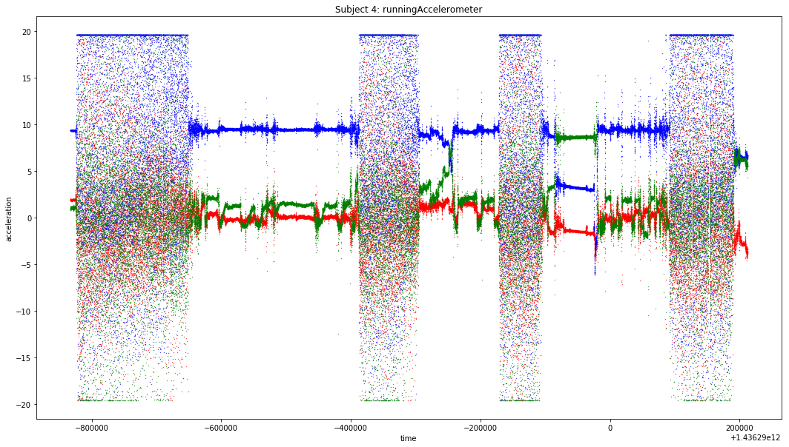
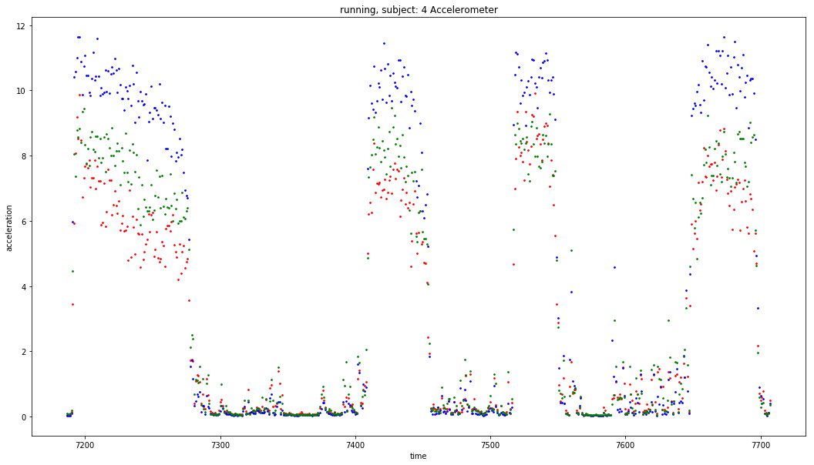
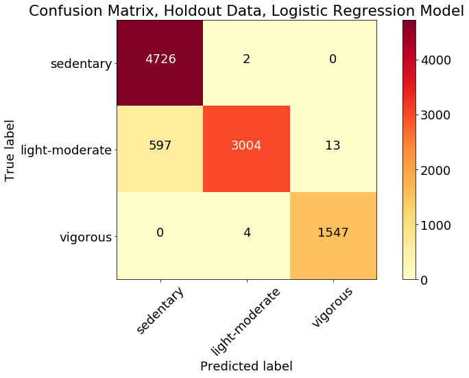
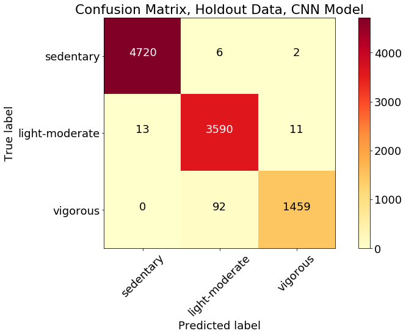

# Using Smartphone Sensors to Encourage Physical Activity

[Presentation](./Using%20Smartphones%20to%20Encourage%20Movement.pdf)

## Sitting: One of the Most Dangerous Daily Activities

Sedentary behavior has become a major public health risk around the world. Experts tell us that a minimum amount of daily physical activity (PA) is necessary to maintain health and reduce the risk of chronic diseases such as diabetes, heart disease, and cancer. Some researchers have suggested that sitting for long periods of time may in itself contribute to the problem, in addition to the total amount of inactivity. A [study published in 2017](https://mfprac.com/web2018/07literature/literature/Misc/SedentaryMortality_Diaz.pdf) found that sitting in periods of longer than 30 minutes at a time increased mortality risk after control for other factors. The total amount of sedentary time was separately a risk factor. A [follow-up study](https://academic.oup.com/aje/article-abstract/188/3/537/5245876) by the same team, published in January 2019, found that there was no benefit of reducing the duration of episodes of sitting unless those episodes were replaced with physical activity (of any intensity). A [study published in April 2019](https://jamanetwork.com/journals/jama/article-abstract/2731178) found that sitting time increased an hour between 2007 and 2016 -- to more than 6 and a half hours for adults and nearly 8 and a half hours for adolescents. 

## A Multi-Sensor in Everyone's Pocket

With the proliferation of screens of all sizes for both work and entertainment, many people find themselves sitting for much of the day. However, the same devices can remind people to be active. Smartphones contain numerous sensors that can be used to classify movement, including the following devices: accelerometer, gyroscope, GPS, and magnetometer (compass). GPS location can only be used outdoors, but the others are potentially effective anywhere.
Continuously polling of smartphone sensors uses a lot of power and would drain phone batteries quickly. Therefore, a useful algorithm should be able to classify activities based on relatively infrequent polling of sensors. Several sources indicate that smartphone gyroscopes use considerably more power than accelerometers.

## A Problem of Human Activity Recognition
There is an extensive literature on using sensors from smartphones and wearable devices to detect and classify different types of human activities. The most-used [UCI-HAR dataset](https://archive.ics.uci.edu/ml/datasets/human+activity+recognition+using+smartphones), published on UCI's machine learning repository, has accelerometer observations from 30 subjects labeled as WALKING, WALKING_UPSTAIRS, WALKING_DOWNSTAIRS, SITTING, STANDING, LAYING (sic).

Although the UCI dataset and many others ask subjects to engage in many different types of activities, for promotion of physical activity, the most basic distinction necessary is between activity and inactivity. It also is important to determine the intensity of the activity, such as walking compared to running. (While some research has suggested that sitting may be worse than standing, we can only say with certainty that the risk lies in sedentary behavior, regardless of type.) he goal of this project is to develop a model using sensor data from ordinary smartphones that can distinguish between a) active and inactive states and b) vigorous and less intense physical activity.

## The Real World Dataset
There are several other publicly available datasets of human activity data that can be used for model development. I chose to use the [Real World Dataset](https://sensor.informatik.uni-mannheim.de/#dataset_realworld) created by the University of Mannheim - Research Group Data and Web Science. This dataset includes two more active activities (running and jumping), in addition to the same six activities in the UCI-HAR dataset. In total the 8 activity classes are: climbing down stairs, climbing up stairs, jumping, lying, standing, sitting, running/jogging, and walking. The researchers outfitted 15 subjects with smartphones or smartwatches in 7 body positions: chest, forearm, head, shin, thigh, upper arm, and waist. I decided to use only the data from the "thigh" position under the assumption that it is the most commonly used of those tested. The dataset includes readings from the following sensors: acceleration, GPS, gyroscope, light, magnetic field, and sound level. The current research was limited to the triaxial (x, y, z) data from the accelerometer and gyroscope. The subjects were asked to perform each activity for 10 minutes (except for jumping). The sensors were recorded at 50 Hz (50 observations per second).

## Exploratory Data Analysis
[Link to EDA Notebook](./notebooks/EDA.ipynb)

I created triaxial scatterplots of the accelerometer and gyroscope data for each of the 15 subjects performing each of the 8 activities. For example, a typical plot of walking accelerometer data is as follows:

A plot of the same subject sitting looks very different:

As can be seen from these plots, the subjects were asked to wait a short time before beginning the assigned activity. Thus the labels for the beginning and end of each activity period are typically incorrect. In addition, it is clear from inspecting the plots that not all subjects performed the assigned activity continuously. For example, Subject 4 stood for several periods in between bouts of running, as can be seen from the following plot:

## Correcting the Labels
[Link to Label Correction Notebook](./notebooks/LabelCorrection.ipynb)

Because the subjects did not perform the assigned activities continuously for the entire period, it was necessary to filter the data to remove periods that would be otherwise mislabeled. The modeling approach was based on dividing the raw data into 2-second windows (100 observations at 50 Hz). I labeled each 100 consecutive observations in each subject/activity with a sample number (dropping any remainder). I then calculated the standard deviation of the sensor data for each of the samples. I then plotted the standard deviations. For example, the following is a plot of the standard deviations of the accelerometer data for Subject 4, running:

The times when the subject was not running can clearly be seen. By inspecting this and similar plots for all the subjects, a threshold of 5 for the standard deviation of the y accelerometer reading was picked as a cutoff. All samples with standard deviation less than 5 were deleted from the data. Similarly, thresholds were established for all the other activities: maxima for stationary activities (sitting, lying) and minima for moving activities. No filtering was done for standing, since it seemed that the subjects did not transition to or from standing during the recording periods.

## From 8 Activities to 3 Classes
I initially tested models of all eight activities. It became apparent that although machine learning models could be fit to training data, they would not generalize with sufficient accuracy on data from subjects not included in the training set. The best model could only produce 75% accuracy on the validation data (when the latter consisted entirely of new subjects). This is insufficient accuracy to be useful for practical purposes. Moreover, for PA promotion it is not necessary to know the exact type of activity. Thus the activities were grouped into three PA classes as follows:
* Sedentary (standing, sitting, lying)
* Light-Moderate PA (walking, going up stairs, going down stairs)
* Vigorous PA (running, jumping)
All of the model results below are based on classifying samples into these three classes.

## Separating Data into Train, Test, and Holdout Sets
[Link to notebook creating the training data](./notebooks/AssembleTrainingDataset.ipynb)

[Link to notebook creating the holdout data](./notebooks/AssembleHoldoutDataset.ipynb)

Data from the first 10 subjects was used to develop and train the model. Data from the remaining 5 subjects was held out for final testing. The training data was divided into train and test samples. I tried two methods: random selection of samples using the "validation split" setting in Keras and manually dividing the sample into a training group of subjects 1 to 7 and a test group of subjects 8 to 10. I found that it was necessary to use a subject-based split of the training and test data. A random split means that there are observations from all 10 subjects in the training data. Although the resulting test scores are high, the model performs poorly on data from subjects not previously seen before. This is because there are significant differences between subjects. Since our use case involves the ability to detect PA from any (previously unseen) user, it is essential to insure that the model is generalizable to new subjects. "K-fold cross validation" is another form of random splitting of the training and test data. The common practice in Human Activity Recognition of creating overlapping samples compounds the problem by including the same information in the training and test data. A [study of these problems in HAR research](https://arxiv.org/abs/1904.02666) found that "k-fold cross validation artificially increases the performance of recognizers by about 10%, and even by 16% when overlapping windows are used."

## Handcrafted Features
[Link to notebook with models using handcrafted features](./notebooks/HandcraftFeatures-Subject_PhysAct.ipynb)

I created a summary dataset where samples of activities conducted by a subject were grouped into windows of 100 observations (representing 2 seconds of measurement). I calculated the mean, standard deviation, and range of the triaxial measurements (x, y, and z dimensions) for both the accelerometer and the gyroscope. These 18 (3 x 3 x 2) features were used in various machine learning models to predict the class (sedentary, light-moderate PA, vigorous PA). The models tested were logistic regression, KNN, various decision trees, SVM, Naive Bayes, and XGBoost. The logistic regression model has the highest accuracy and F1 score on the validation data (although only by a small amount). An inspection of the correlation coefficients shows that many of the gyroscope features were highly correlated with the accelerometer features (r > 0.9). A logistic regression model including only the accelerometer features had the same accuracy and F1 score as the model including all features. 

## Neural Network Model
[Link to notebook with neural network model](./notebooks/Convolution-SubjectTTS.ipynb)

Instead of creating "handcrafted features," a neural network model uses the raw sensor data, formatted in this case as an array of 100 observations (2 seconds) x 6 sensor readings. Because there is a time dimension to the data, it is appropriate to use a recurrent layer. I used the gated recurrent unit (GRU) technique because it has fewer parameters than LSTM and may have better performance on smaller datasets. Convolutional layers can improve the result by helping the model to learn important features, preventing overfitting, and reducing the number of parameters. Batch normalization was used to further reduce overfitting. The final model consisted of:
  
* two convolution layers, with 50 filters, 3 kernels, and RELU activation, each followed by a pooling and a batch normalization layer
* two recurrent (GRU) layers each with 64 neurons and tanh activation (the second layer with a recurrent dropout of 0.2)
* a dropout layer with a dropout rate of 0.1
* a final dense layer representing the three classes to be predicted.

## Tests on Holdout Data
[Link to notebook with test of LR model on holdout data](./notebooks/Holdout-Test.ipynb)

The Logistic Regression model was tested on the holdout data consisting of the remaining five subjects. The overall accuracy of the predictions was 94%, and the weighted average F1 score was 0.54. A confusion matrix by class is shown below:

The overall accuracy of the model is very high. However, the model misclassified about 600 samples (11%) as "sedentary" that were in fact light-moderate PA. There was no improvement when adding the gyroscope data. This result is significant: using just one sensor and simple statistical features can predict physical activity with very high accuracy.

The neural network model was even better than the LR model, achieving 99% accuracy. Almost 100 samples that were actually vigorous were miscoded as "light-moderate." This is a very small error rate, and is a better type of error than the LR model in that the mislabeling concerns the degree of physical activity rather than a confusion between movement and sedentary behavior.

## Further Improvements
This model was tested on only 15 subjects. I would like to incorporate other public datasets to create a more robust model with more subjects, different hardware, different test situations, and different environments. In addition, I would like to see if a reduction from a sampling rate of 50 Hz to 10-25 Hz still produces a robust model, since a lower sampling rate represents a significant reduction in power consumption.
